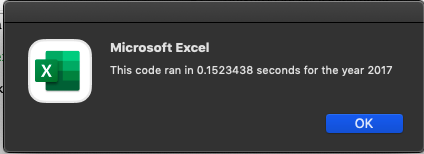
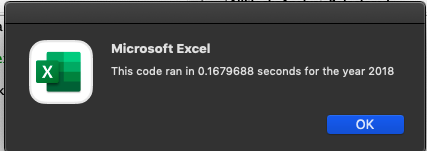

# stock-analysis
### Module 2 Stock Analysis using VBA

## Overview of Project
This project was intended to aid Steve in his assessment of stocks for his parents. Code from the original analysis on greenstocks was refactored to improve its runtime on larger data sets. This was necessary to include the entire stock market in our anaylsis.

## Results

# The images below demonstrates my ability to improve the run time of my code.
The intial run time for 2017 was  .7695312.
The intial run time for 2018 was  .765623.

# The following code helped me to accomplish this task for Steve.

'1a) Create a ticker Index

tickerIndex = 0

'1b) Create three output arrays

Dim tickerVolumes(12) As Long
Dim tickerStartingPrices(12) As Single
Dim tickerEndingPrices(12) As Single

'2a) Create a for loop to initialize the tickerVolumes to zero.

For i = 0 To 11
    
    tickerVolumes(i) = 0
    
Next i

'2b) Loop over all the rows in the spreadsheet.

For i = 2 To RowCount

  '3a) Increase volume for current ticker
  
    tickerVolumes(tickerIndex) = tickerVolumes(tickerIndex) + Cells(i, 8).Value
    
  '3b) Check if the current row is the first row with the selected tickerIndex.
    
    If Cells(i, 1).Value = tickers(tickerIndex) And Cells(i - 1, 1).Value <> tickers(tickerIndex) Then
        tickerStartingPrices(tickerIndex) = Cells(i, 6).Value
    End If
    
  '3c) check if the current row is the last row with the selected ticker
    
     If Cells(i, 1).Value = tickers(tickerIndex) And Cells(i + 1, 1).Value <> tickers(tickerIndex) Then
        tickerEndingPrices(tickerIndex) = Cells(i, 6).Value
     End If

  '3d Increase the tickerIndex.

    If Cells(i, 1).Value = tickers(tickerIndex) And Cells(i + 1, 1).Value <> tickers(tickerIndex) Then
        tickerIndex = tickerIndex + 1
    End If
        

Next i

'4) Loop through your arrays to output the Ticker, Total Daily Volume, and Return.
 
 For i = 0 To 11
 
    Worksheets("All Stocks Analysis").Activate
    Cells(4 + i, 1).Value = tickers(i)
    Cells(4 + i, 2).Value = tickerVolumes(i)
    Cells(4 + i, 3).Value = tickerEndingPrices(i) / tickerStartingPrices(i) - 1
    
Next i

## Summary

### Pros/Cons of the Original Code
The original code was easier to construct, as it was able to make direct callouts to positions/places in the various worksheets. However, because it is constructed in a manner that is specific to the greenstocks data it will need to be updated and reassessed alongside any changes to the data. Considering how frequenty stocks need to be analyzed, it is inefficient to manually alter this code each time new data is imported.

### Pros/Cons of Refactored Code
The refactored code was difficult to construct because it was a more comprehensive code that allowed the computer to identify various boundries and features of the data. However, writing the code in this manner allows the macro to be run on any stock data that shares the same overlying worksheet structure. Additionally, it drastically improves the run time of the code. The time invested in constructing this more comprehensive code is repaid when no manual alterations are necessary to analyze new stock data. 
